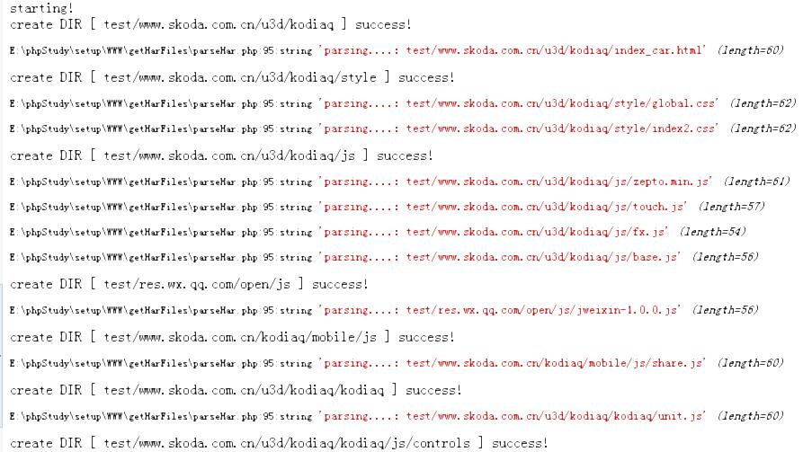

# grabSourceByHar
grap website's source files async, and save them to local disk  .

1. firstly,get the har file:
  - open your chrome browser,press F12, open the developer tools
  - enter the website you want to get source files
  - wait until the site load finished,then go to the `network` file list,select one file,right mouse click,`save as HAR with content`.
  - save the xxxx.har file to your local disk.
  
2. use this php code to load your har file
- change the har file name to yours
- open this php file in your browser
- wait until the page shows everything finished...

Then you can find the source files in your local disks..

see more details at [blog.opengl.cc](blog.opengl.cc)
